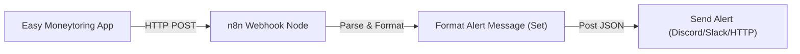

# Easy Moneytoring n8n Webhook Integration Guide

This guide contains the step-by-step instructions and the copy-paste-ready **n8n Workflow JSON** to connect your Easy Moneytoring application to your local n8n server. This will enable real-time alert broadcasts (e.g. to a family Discord channel, Slack channel, or Telegram bot) whenever a new transaction is logged!

---

## 🚀 The n8n Workflow Architecture



---

## 📋 Step-by-Step Setup Instructions

### Step 1: Copy & Import the n8n Workflow
1. Hover over the JSON code block in the **n8n Workflow Schema** section below and click **Copy**.
2. Open your **n8n workspace dashboard** in your web browser.
3. Click **Add workflow** or open a blank canvas.
4. Click anywhere on the blank canvas and press **`Ctrl + V`** (Windows) or **`Cmd + V`** (Mac).
5. **Boom!** n8n will instantly render and connect all three nodes for you!

### Step 2: Configure the Target Notification Channel
1. Double-click the **Send Notification (Discord/Slack)** node.
2. Replace the placeholder URL (`https://discord.com/api/webhooks/your-webhook-url-here`) with your actual:
   * **Discord Webhook URL** (Create one in *Discord Server Settings -> Integrations -> Webhooks*).
   * **Slack Webhook URL** (Create one in Slack App Directory).
   * **Telegram/Alternative bot endpoint** if you customize the HTTP parameters.
3. Save the node.

### Step 3: Turn on the Workflow
1. Click the **Active** toggle switch in the top-right corner of the n8n workspace to turn it **ON** (Active).
2. Copy the **Production Webhook URL** provided by the **Easy Moneytoring Webhook** node (e.g., `https://wild-islands-pump.loca.lt/webhook/expense-added`).

### Step 4: Configure Easy Moneytoring
1. Open your **Easy Moneytoring** app.
2. Tap the **Profile** tab at the bottom right.
3. Turn on the **n8n Webhook Alerts** toggle.
4. Paste your n8n **Production Webhook URL** in the endpoint field.
5. Tap **Send Test Webhook** to confirm everything is wired correctly!

---

## 📦 n8n Workflow Schema (Copy-Paste Ready)

Copy this entire JSON block and paste it directly onto your blank n8n canvas:

```json
{
  "name": "Easy Moneytoring Alerts",
  "nodes": [
    {
      "parameters": {
        "httpMethod": "POST",
        "path": "expense-added",
        "options": {}
      },
      "id": "webhook-node-id",
      "name": "Easy Moneytoring Webhook",
      "type": "n8n-nodes-base.webhook",
      "typeVersion": 1,
      "position": [
        250,
        300
      ]
    },
    {
      "parameters": {
        "keepOnlySet": true,
        "values": {
          "string": [
            {
              "name": "formattedMessage",
              "value": "=💸 *NEW TRANSACTION LOGGED!*\n━━━━━━━━━━━━━━━━━━\n👤 *Spender:* {{$json.body.user.nickname}}\n🛍️ *Item:* {{$json.body.expense.description}}\n🏷️ *Category:* {{$json.body.expense.category}}\n💰 *Amount:* ${{$json.body.expense.amount.toFixed(2)}}\n📅 *Date:* {{$json.body.expense.date}}\n━━━━━━━━━━━━━━━━━━\n\n*Logged via Easy Moneytoring Cloud Sync*"
            }
          ]
        },
        "options": {}
      },
      "id": "format-node-id",
      "name": "Format Alert Message",
      "type": "n8n-nodes-base.set",
      "typeVersion": 1,
      "position": [
        450,
        300
      ]
    },
    {
      "parameters": {
        "url": "https://discord.com/api/webhooks/your-webhook-url-here",
        "method": "POST",
        "sendHeaders": true,
        "headerParameters": {
          "parameters": [
            {
              "name": "Content-Type",
              "value": "application/json"
            }
          ]
        },
        "sendBody": true,
        "specifyBody": "json",
        "jsonBody": "={\n  \"content\": \"{{$json.formattedMessage}}\"\n}",
        "options": {}
      },
      "id": "send-node-id",
      "name": "Send Notification (Discord/Slack)",
      "type": "n8n-nodes-base.httpRequest",
      "typeVersion": 4,
      "position": [
        650,
        300
      ]
    }
  ],
  "connections": {
    "Easy Moneytoring Webhook": {
      "main": [
        [
          {
            "node": "Format Alert Message",
            "type": "main",
            "index": 0
          }
        ]
      ]
    },
    "Format Alert Message": {
      "main": [
        [
          {
            "node": "Send Notification (Discord/Slack)",
            "type": "main",
            "index": 0
          }
        ]
      ]
    }
  },
  "active": false,
  "settings": {},
  "versionId": "1a2b3c4d-5e6f-7a8b-9c0d-1e2f3a4b5c6d"
}
```
